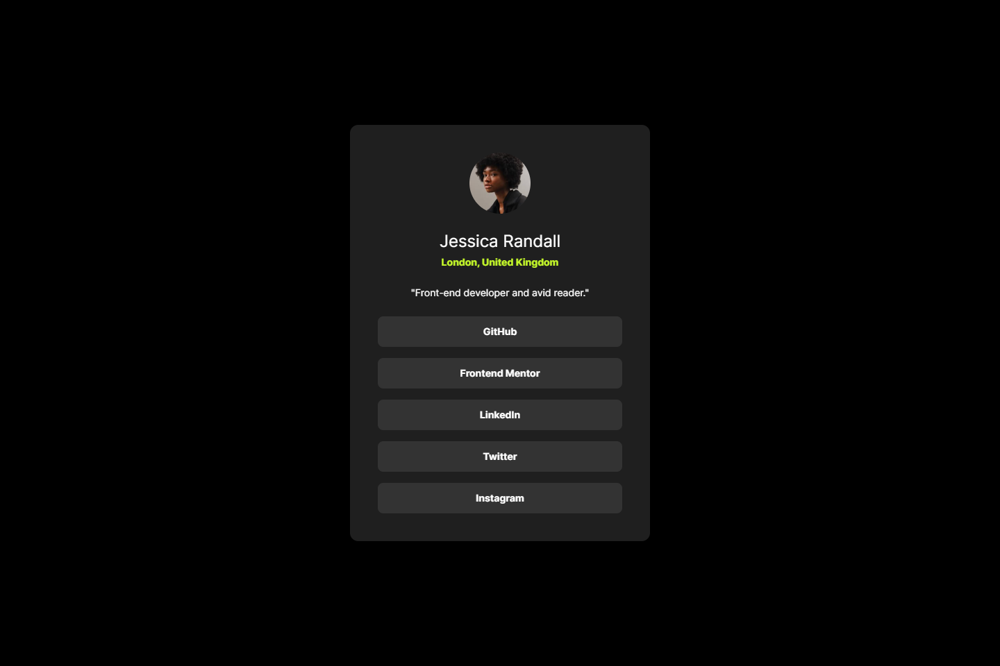
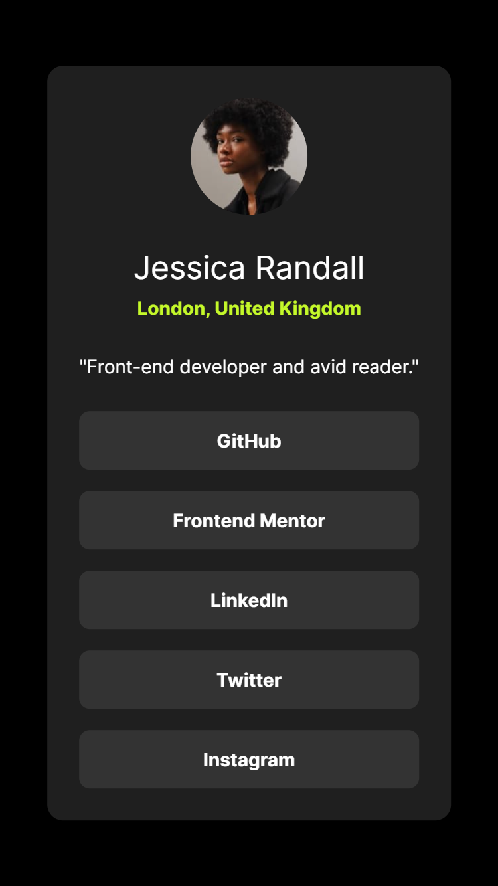

# Frontend Mentor - Social links profile solution

This is a solution to the [Social links profile challenge on Frontend Mentor](https://www.frontendmentor.io/challenges/social-links-profile-UG32l9m6dQ). Frontend Mentor challenges help you improve your coding skills by building realistic projects.

## Table of contents

-   [Overview](#overview)
    -   [Screenshot](#screenshot)
    -   [Links](#links)
-   [My process](#my-process)
    -   [Built with](#built-with)
    -   [What I learned](#what-i-learned)
    -   [Useful resources](#useful-resources)
-   [Author](#author)

## Overview

### Screenshot

#### Desktop

#### Mobile

### Links

-   Solution URL: [https://github.com/david-pang/frontend-mentor-social-links-profile-tailwind/](https://github.com/david-pang/frontend-mentor-social-links-profile-tailwind/)
-   Live Site URL: [https://david-pang.github.io/frontend-mentor-social-links-profile-tailwind/](https://david-pang.github.io/frontend-mentor-social-links-profile-tailwind/)

## My process

### Built with

-   Semantic HTML5 markup
-   Tailwind CSS
-   Mobile-first workflow

### What I learned

This challenge allowed me to apply my Tailwind CSS skills to a simple project.

### Useful resources

-   [Tailwind Docs](https://tailwindcss.com/docs) - The Tailwind docs provide the most up-to-date information on the Tailwind Features.

## Author

-   Frontend Mentor - [@david-pang](https://www.frontendmentor.io/profile/david-pang)
